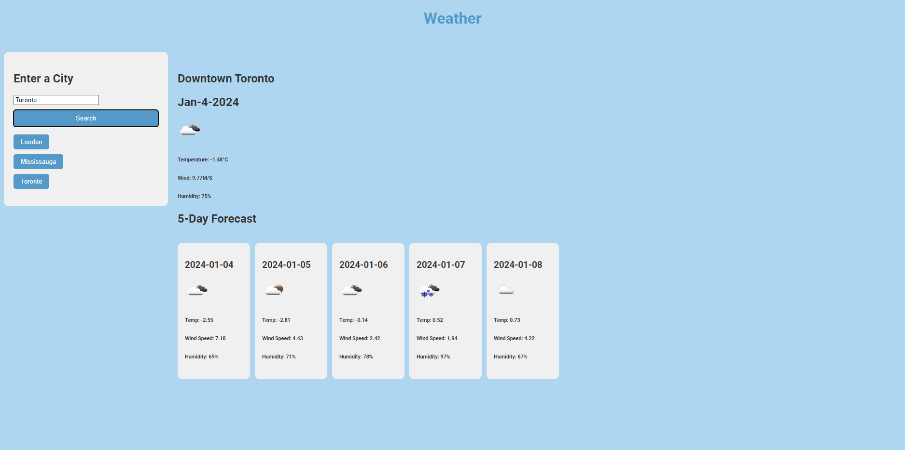

# weatherapp
A web application that can show you the weather in the inputted area.
This features a search bar to find the weather for a specific city. recently searched cities will appear in a search history that can be clicked on to automatically research that city. 

It displays the current weather for that day, as well as the next 5 days. The stats displayed are the temp, wind speed and humidity, along with a small icon to show the general weather.

